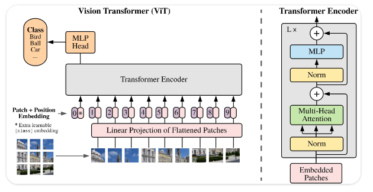
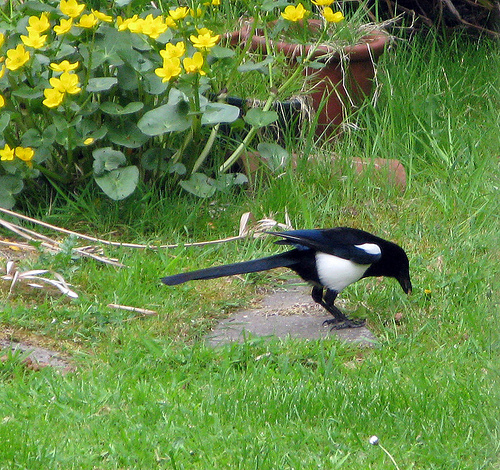

# vit.cpp

Inference Vision Transformer (ViT) in plain C/C++ using ggml without any extra dependencies

## Description


This project presents a standalone implementation of the well known Vision Transformer (ViT) model family, used in a broad spectrum of applications and SOTA models like Large Multimodal Models(LMM). The primary goal is to develop a C/C++ inference engine tailored for ViT models, utilizing [ggml](https://github.com/ggerganov/ggml) to enhance performance, particularly on edge devices. Designed to be both lightweight and self-contained, this implementation can be run across diverse platforms.

<details>
<summary>Table of Contents</summary>

1. [Description](#Description)
2. [Features](#features)
3. [Vision Transformer Architecture](#vision-transformer-architecture)
4. [Quick Example](#quick-example)
5. [Convert PyTorch to GGUF](#convert-pytorch-to-gguf)
6. [Build](#build)
   - [Simple Build](#simple-build)
   - [Per Device Optimizations](#per-device-optimizations)
   - [OpenMP](#using-openmp)
7. [Run](#run)
8. [Benchmark against PyTorch](#benchmark-against-pytorch)
   - [ViT Inference](#vit-inference)
   - [Benchmark on Your Machine](#benchmark-on-your-machine)
9. [Quantization](#quantization)
10. [To-Do List](#to-do-list)
</details>


## Features


- Dependency-free and lightweight inference thanks to [ggml](https://github.com/ggerganov/ggml).
- 4-bit, 5-bit and 8-bit quantization support.
- Support for timm ViTs with different variants out of the box.

An important aspect of using `vit.cpp` is that it has short startup times compared to common DL frameworks, which makes it suitable for serverless deployments where the cold start is an issue.

## Vision Transformer architecture


The implemented architecture is based on the original Vision Transformer from:
  - [An Image is Worth 16x16 Words: Transformers for Image Recognition at Scale](https://arxiv.org/abs/2010.11929)

<p align="center">
  
</p>
<p align="center">
  ViT architecture. Taken from the <a href="https://arxiv.org/abs/2010.11929">original paper</a>.
</p>

## Quick example


<details>
  <p align="center">
    
  </p>

  <summary>See output</summary>
  <pre>
  $ ./bin/vit -t 4 -m ../ggml-model-f16.gguf -i ../assets/magpie.jpeg -k 5
  main: seed = 1701176263
  main: n_threads = 4 / 8
  vit_model_load: loading model from &apos;../ggml-model-f16.gguf&apos; - please wait
  vit_model_load: hidden_size            = 192
  vit_model_load: num_hidden_layers      = 12
  vit_model_load: num_attention_heads    = 3
  vit_model_load: patch_size             = 16
  vit_model_load: img_size               = 224
  vit_model_load: num_classes            = 1000
  vit_model_load: ftype                  = 1
  vit_model_load: qntvr                  = 0
  operator(): ggml ctx size =  11.13 MB
  vit_model_load: ................... done
  vit_model_load: model size =    11.04 MB / num tensors = 152
  main: loaded image &apos;../assets/magpie.jpeg&apos; (500 x 470)
  vit_image_preprocess: scale = 2.232143
  processed, out dims : (224 x 224)


  &gt; magpie : 0.87
  &gt; goose : 0.02
  &gt; toucan : 0.01
  &gt; drake : 0.01
  &gt; king penguin, Aptenodytes patagonica : 0.01


  main:    model load time =    17.92 ms
  main:    processing time =   146.96 ms
  main:    total time      =   164.88 ms
  </pre>
</details>


## Convert PyTorch to GGUF


    # clone the repo recursively
    git clone --recurse-submodules https://github.com/staghado/vit.cpp.git

    cd vit.cpp

    # install torch and timm
    pip install torch timm

    # list available models if needed; note that not all models are supported
    python convert-pth-to-ggml.py --list

    # convert the weights to gguf : vit tiny with patch size of 16 and an image 
    # size of 384 pre-trained on ImageNet21k and fine-tuned on ImageNet1k
    python convert-pth-to-ggml.py --model_name vit_tiny_patch16_384.augreg_in21k_ft_in1k --ftype 1

> **Note:** You can also download the converted weights from [Hugging Face](https://huggingface.co/staghado/vit.cpp) directly.

> ```wget https://huggingface.co/staghado/vit.cpp/blob/main/tiny-ggml-model-f16.gguf```


## Build


### Simple build


    # build ggml and vit 
    mkdir build && cd build
    cmake .. && make -j4

    # run inference
    ./bin/vit -t 4 -m ../ggml-model-f16.gguf -i ../assets/tench.jpg

The optimal number of threads to use depends on many factors and more is not always better. Usually using a number of threads equal to the number of available physical cores gives the best performance in terms of speed.

### Per device optimizations


Generate per-device instructions that work best for the given machine rather than using general CPU instructions.
This can be done by specifying `-march=native` in the compiler flags.
  * Multi-threading and vectorization
  * Loop transformations(unrolling)

#### For AMD host processors


You can use a specialized compiler released by AMD to make full use of your specific processor's architecture.
Read more here : [AMD Optimizing C/C++ and Fortran Compilers (AOCC)](https://www.amd.com/en/developer/aocc.html)

You can follow the given instructions to install the AOCC compiler.

Note : For my AMD Ryzen 7 3700U, the improvements were not very significant but for more recent processors there could be a gain in using a specialized compiler.

### Using OpenMP


Additionally compile with OpenMP by specifying the `-fopenmp` flag to the compiler in the CMakeLists file,
allowing multithreaded runs. Make sure to also enable multiple threads when running, e.g.:

    OMP_NUM_THREADS=4 ./bin/vit -t 4 -m ../ggml-model-f16.bin -i ../assets/tench.jpg

## Run


    usage: ./bin/vit [options]

    options:
      -h, --help              show this help message and exit
      -s SEED, --seed SEED    RNG seed (default: -1)
      -t N, --threads N       number of threads to use during computation (default: 4)
      -m FNAME, --model FNAME model path (default: ../ggml-model-f16.bin)
      -i FNAME, --inp FNAME   input file (default: ../assets/tench.jpg)
      -k N, --topk N          top k classes to print (default: 5)
      -e FLOAT, --epsilon     epsilon (default: 0.000001)


## Benchmark against PyTorch


First experiments on Apple M1 show inference speedups(up to 6x faster for base model) compared to native PyTorch inference. 

### ViT inference


You can efficiently run ViT inference on the CPU.
Memory requirements and inference speed on AMD Ryzen 7 3700U(4 cores, 8 threads) for both native PyTorch and `vit.cpp`. 
Using 4 threads gives better results for my machine. The reported results of inference speed correspond to 10 runs averages for both PyTorch and `vit.cpp`.

| Model  | Max Mem(PyTorch)  | Max Mem            | Speed(PyTorch) | Speed          |
| :----: | :-----------: | :------------: | :------------: | :------------: |
| tiny   | ~780 MB       | **~20 MB**     | 431 ms         | **120 ms**     |
| small  | ~965 MB       | **~52 MB**     | 780 ms         | **463 ms**     |
| base   | ~1.61 GB      | **~179 MB**    | 2393 ms        | **1441 ms**    |
| large  | ~3.86 GB      | **~597 MB**    | 8151 ms        | **4892 ms**    |

> **Note:** The models used are of the form `vit_{size}_patch16_224.augreg_in21k_ft_in1k`.

### Benchmark on your machine


In order to test the inference speed on your machine, you can run the following scripts:

    chmod +x scripts/benchmark.*

    # install memory_profiler & threadpoolctl
    pip install memory_profiler threadpoolctl

    # run the benchmark of PyTorch
    python scripts/benchmark.py

    # run the benchmark of vit.cpp for non-qunatized model
    ./scripts/benchmark.sh

    # to run the benchamrk for qunatized models; 4 threads and quantize flag
    ./scripts/benchmark.sh 4 1

Both scripts use 4 threads by default. In Python, the `threadpoolctl` library is used to limit the number of threads used by PyTorch.

## Quantization


`vit.cpp` supports many quantization strategies from ggml such as q4_0, q4_1, q5_0, q5_1 and q8_0 types.
You can quantize a model in F32 (the patch embedding is in F16) to one of these types by using the `./bin/quantize` binary. 
```
usage: ./bin/quantize /path/to/ggml-model-f32.gguf /path/to/ggml-model-quantized.gguf type                              
  type = 2 - q4_0                                                                                                       
  type = 3 - q4_1                                                                                                       
  type = 6 - q5_0                                                                                                       
  type = 7 - q5_1                                                                                                       
  type = 8 - q8_0                                                                                                       
```

For example, you can run the following to convert the model to q5_1:

```shell
./bin/quantize ../tiny-ggml-model-f16.gguf ../tiny-ggml-model-f16-quant.gguf 7
```

Then you can use `tiny-ggml-model-f16-quant.gguf` just like the model in F16.

### Results

Here are the benchmarks for the different models and quantizations on my machine: 
For accurate estimation of run times, these benchmarks were run 100 times each.  

| Model  | Quantization | Speed (ms)    | Mem (MB)          |
| :----: | :----------: | :-----------: | :---------------: |
|   tiny |     q4_0     |    105 ms     |   12 MB        |
|   tiny |     q4_1     |    97 ms     |   12 MB        |
|   tiny |     q5_0     |    116 ms     |   13 MB        |
|   tiny |     q5_1     |    112 ms     |   13 MB        |
|   tiny |     q8_0     |    90 ms     |   15 MB        |
|   small |     q4_0     |    240 ms     |   23 MB        |
|   small |     q4_1     |    224 ms     |   24 MB        |
|   small |     q5_0     |    288 ms     |   25 MB        |
|   small |     q5_1     |    277 ms     |   27 MB        |
|   small |     q8_0     |    228 ms     |   33 MB        |
|   base |     q4_0     |    704 ms     |   61 MB        |
|   base |     q4_1     |    626 ms     |   66 MB        |
|   base |     q5_0     |    851 ms     |   71 MB        |
|   base |     q5_1     |    806 ms     |   76 MB        |
|   base |     q8_0     |    659 ms     |   102 MB        |
|   large |     q4_0     |    2189 ms     |   181 MB        |
|   large |     q4_1     |    1919 ms     |   199 MB        |
|   large |     q5_0     |    2676 ms     |   217 MB        |
|   large |     q5_1     |    2547 ms     |   235 MB        |
|   large |     q8_0     |    1994 ms     |   325 MB        |

## To-Do List


- **Evaluate performance on ImageNet1k**: 

  Run evaluation on ImageNet1k test set and analyze the performance of different quantization schemes.

This project was highly inspired by the following projects:
* [whisper.cpp](https://github.com/ggerganov/whisper.cpp)
* [llama.cpp](https://github.com/ggerganov/llama.cpp)

## Star History

[](https://star-history.com/#staghado/vit.cpp&Date)
